AVR マイコンにスケッチを書き込む為のシールドです。
書き込み方式はISPとなります。

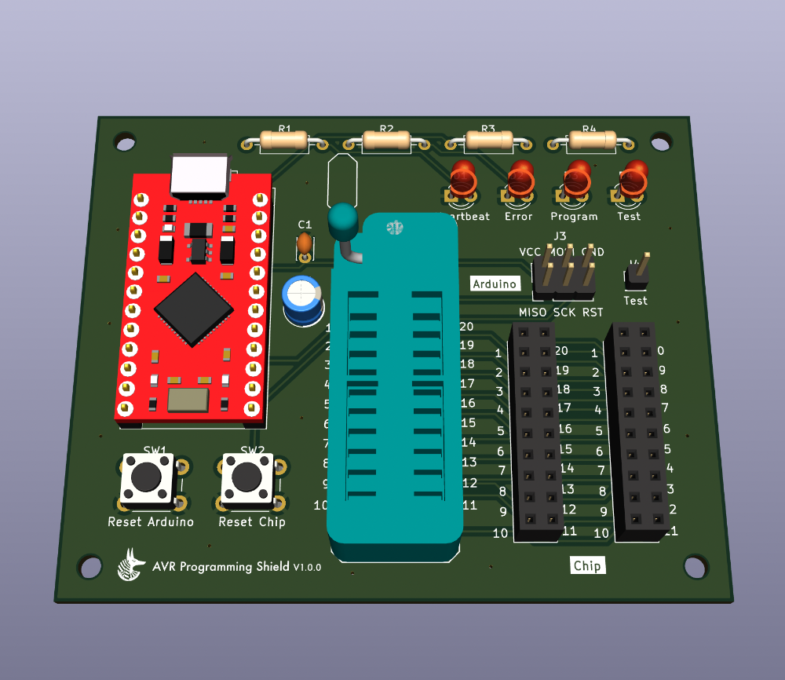

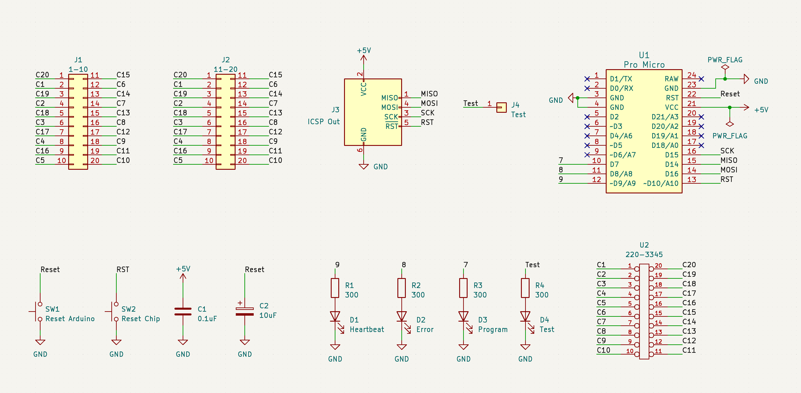

# 使い方

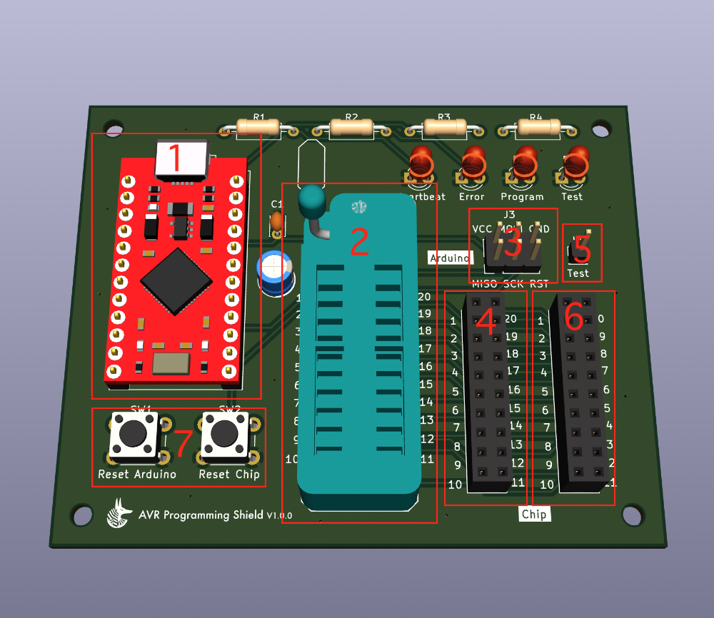

## 1. Arduino Pro Microを設置

## 2. AVRマイコンを設置
レバー側を上として上に詰めるようにAVRマイコンを配置しレーバーを倒します。

## 3. ジャンパーケーブルを接続
すべてのピンにジャンパーケーブルを接続します。

## 4. AVRマイコンに合わせてジャンパーケーブルを接続
2のソケット左右に書かれた1-20の番号と4の1-20の番号は内部で接続されています。
例えば2のソケットの1番は、4の1と繋がっています。
3で接続したジャンパーピンをマイコンのデータシートを見ながら4の必要な番号に接続します。

### [接続例] ATiny2313
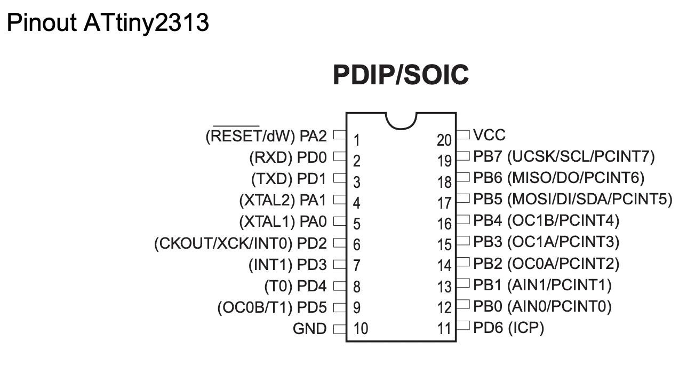

| シールド | ATiny2313  |
|------|-----|
| VCC  | 20  |
| MOSI | 17  |
| GND  | 10  |
| MISO | 18  |
| SCK  | 19  |
| RST  | 1   |

## 5. LEDのテスト用ピン
LEDで正常に書き込めるかテストができます。

## 6. 外部出力
4の1-20と内部で接続されています。ブレッドボードなどと接続する用途で使えます。

## 7. リセットボタン

# 必要なパーツ

| リファレンス  | 名前                    | サイズ/容量                 | 数   |
|---------|-----------------------|------------------------|-----|
| U1      | Arduino Pro Micro     |                        | 1   |
| C1      | セラミックコンデンサ            | 104 (0.1uF)            | 1   |
| C2      | 電解コンデンサ               | 10uF                   | 1   |
| D1-D4   | LED              | 3mm 5V                 | 4   |
| U2      | ZIF ソケット  | 2.54mmピッチ 20pin 300mil | 1   |
| R1-R4   | カーボン抵抗                | 300Ω前後                 | 4   |
| SW1,Sw2 | タクトスイッチ            | 5mm                    | 2   |
| J1      | ピンソケット      | 2.54mmピッチ 2x10         | 2   |
| J2      | ピンソケット      | 2.54mmピッチ 1x12         | 2   |
| J3      | ピンヘッダー      | 2.54mmピッチ 2x3          | 1   |
| J4      | ピンヘッダー      | 2.54mmピッチ 1x1          | 1   |

# その他の必要なもの

- ジャンパーケーブル(メス、オス) x 7

# スケッチの書き込み

## [初回のみ] Arduino Pro MicroにArduinoISPを書き込む

**File > Examples > 11.ArduinoISP**

普段通りスケッチを開いてアップロードボタンを押すだけです。
このシールドに載せたままでは書き込みできないので、載せずに書き込みしてください。
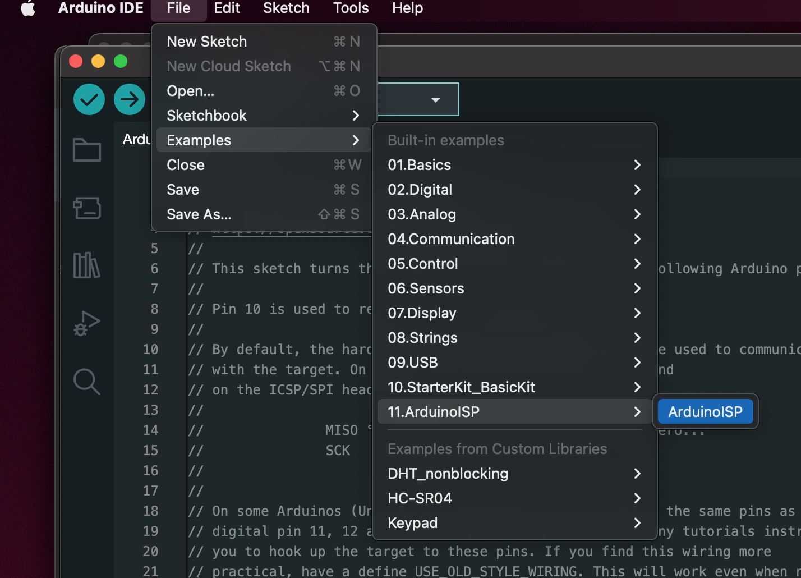

## [初回のみ] ブートローダーを書き込みする
ブートローダーを書き込む為ではなく、クロック数を合わせる為に必要なようです。

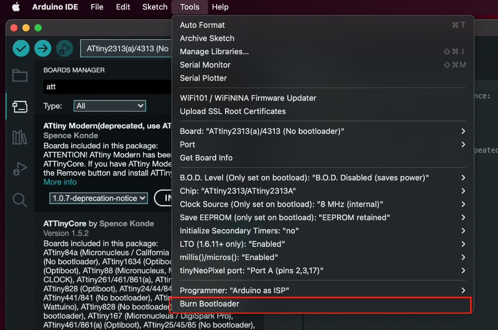

## プログラマにArduino as ISPを選択する

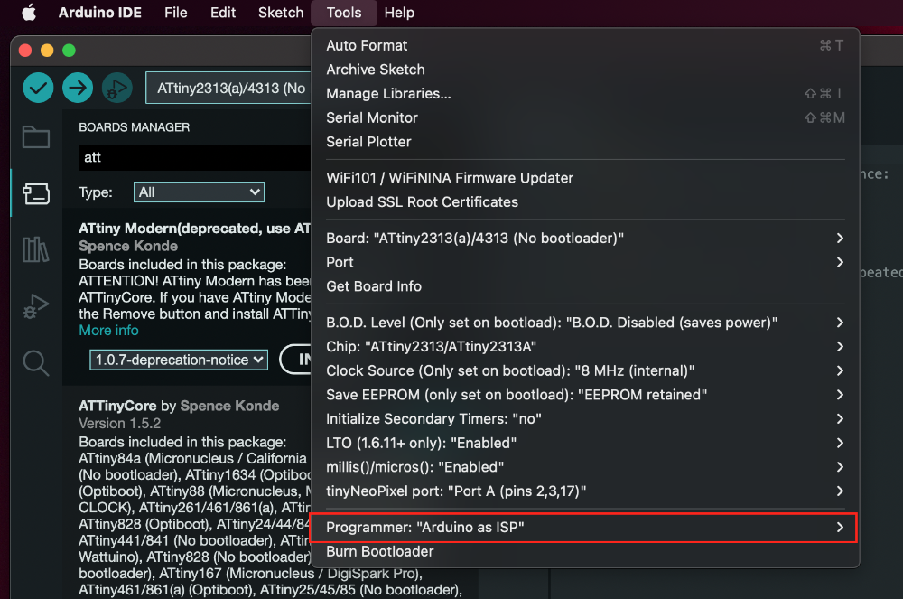

## スケッチの書き込みの際はプログラマーを使ってアップロードで書き込みする

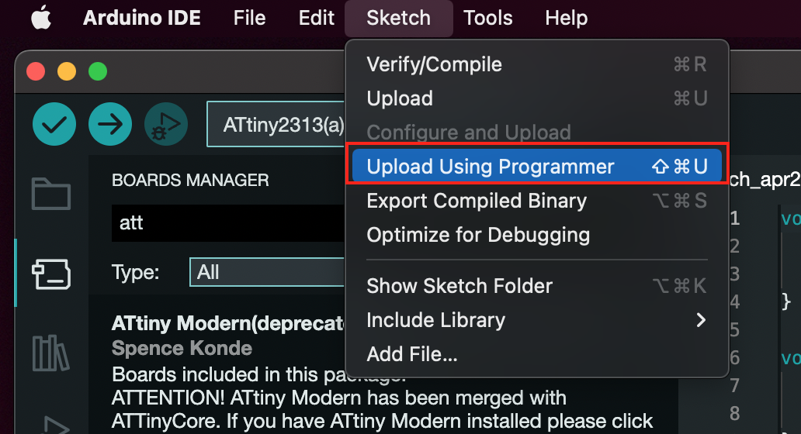

# 基板の発注
[PCBWay](https://www.pcbway.jp/g/ug57q0)に注文する場合、対応するGerber Fileを利用できます。

- [ProgrammingShield V1.0.kicad_pcb.zip](ProgrammingShield V1.0.kicad_pcb.zip)

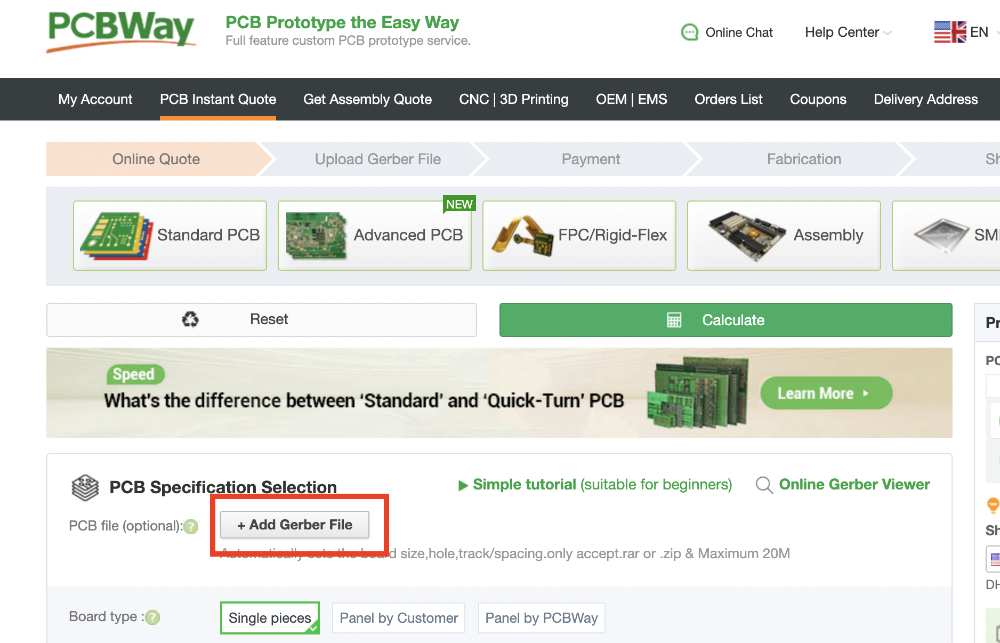

## 修正したい場合
KiCad 7のデータがそのまま含まれています。ダウンロードして自由に修正してください。
開く前に下記2つのデータをインストールする必要があります。

- [ArduinoのKiCAD用ライブラリ公開](https://www.g200kg.com/archives/2020/11/arduinokicad.html)
- [kicad用ゼロプレッシャーICソケットの部品](http://ayabu.blog.shinobi.jp/kicad/kicad%E7%94%A8%E3%82%BC%E3%83%AD%E3%83%97%E3%83%AC%E3%83%83%E3%82%B7%E3%83%A3%E3%83%BCic%E3%82%BD%E3%82%B1%E3%83%83%E3%83%88%E3%81%AE%E9%83%A8%E5%93%81)

## 修正した後に基板を発注したい場合

[PCBWay](https://www.pcbway.jp/g/ug57q0)に注文する場合、プラグイン&コンテンツマネージャーよりPCBWayのプラグインを導入するとワンクリックでGerber Fileの生成とzip圧縮、注文画面へのzip貼り付けを自動でやってくれるので便利です。

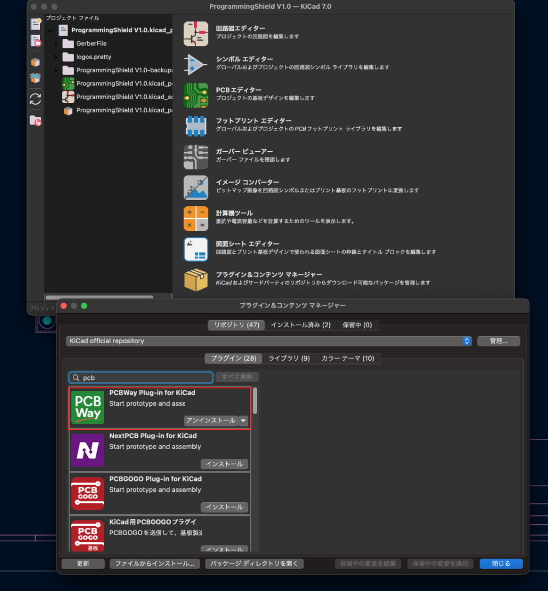
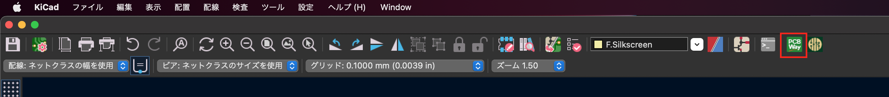

# 動作確認済み AVRマイコン
- ATtiny 13A
- ATtiny 44A
- ATtiny 84A
- ATtiny 2313
